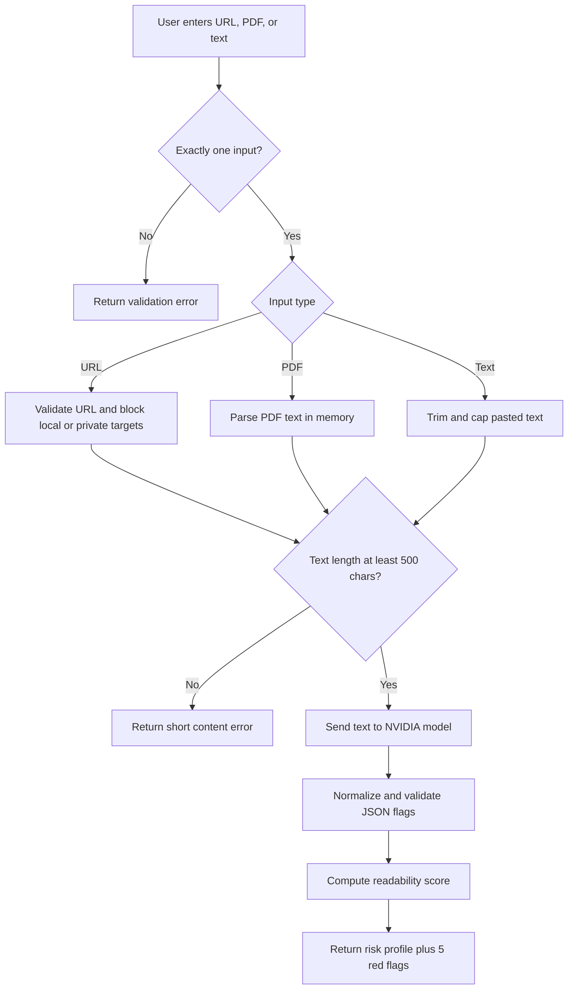
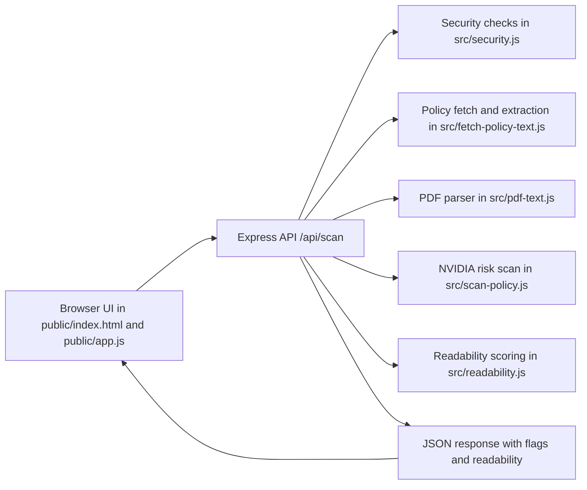
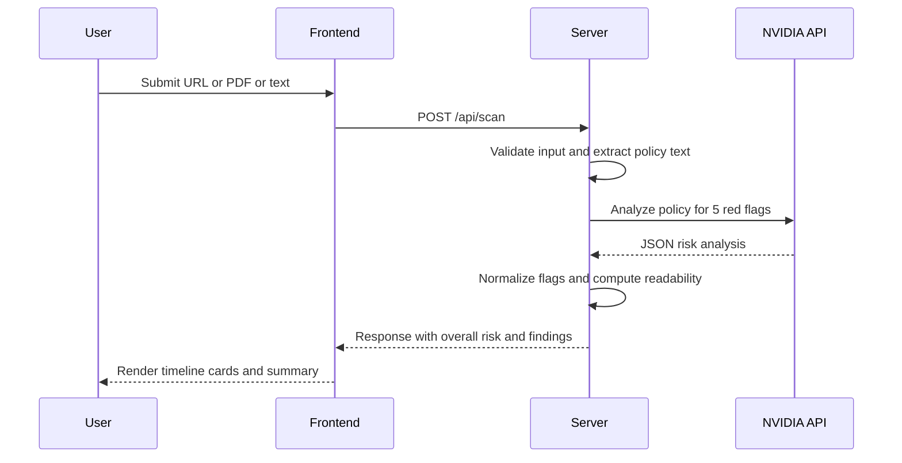

# PrismClause - ToS Red Flag Scanner

I built this app to quickly inspect Terms of Service and Privacy Policies without reading every dense legal paragraph line by line.

It accepts a policy URL, a PDF upload, or pasted text and returns the five most concerning clauses with severity, plain English explanation, and impact.

## Repository details

- Description: Scan Terms and Privacy policies for risky clauses in plain English.
- Website: https://syllabuscal.ranjansharma.info.np
- Topics: terms-of-service privacy-policy legal-tech risk-analysis policy-scanner nodejs express

## Live website

https://syllabuscal.ranjansharma.info.np

## What this project does

- Supports three input methods: URL, PDF, and pasted policy text
- Enforces one input method at a time to keep scans clean
- Offers broad and strict analysis modes
- Returns five red flags with quote, clause type, severity, and human explanation
- Computes a legalese readability score from the extracted text
- Applies baseline API hardening with URL validation, SSRF checks, size limits, Helmet, and rate limiting

## Flowchart



## Architecture diagram



## Request sequence



## Tech stack

- Node.js
- Express
- Cheerio
- pdf-parse
- Axios
- Helmet
- express-rate-limit

## Local setup

```bash
npm install
cp .env.example .env
```

Set `NVIDIA_API_KEY` in `.env`, then run:

```bash
npm start
```

App URL: http://localhost:3000

## Run tests

```bash
npm test
```
